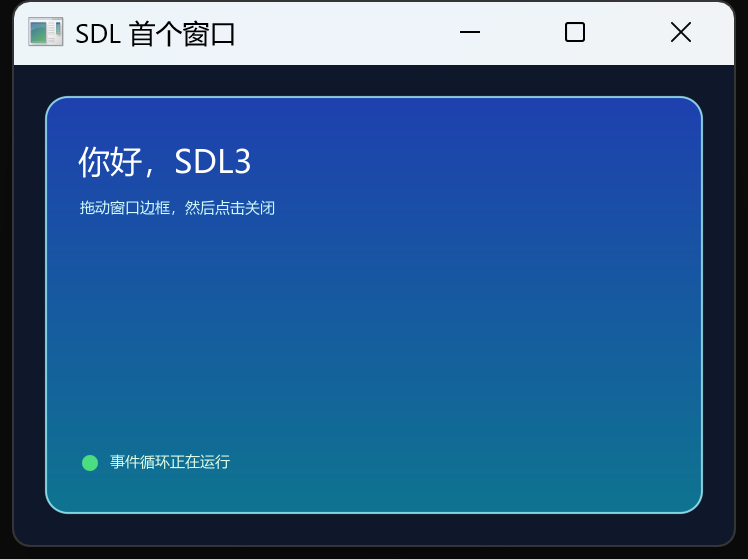

# 打开首个 SDL 窗口

## 你将完成

本页从一个真正的空目录开始，创建 `cjpm.toml` 和 `src/main.cj`，最后显示一个 720×480 的窗口。窗口中有标题、说明文字、圆角卡片和状态圆点；拖动边框改变尺寸后，卡片仍按当前逻辑尺寸绘制；点击关闭按钮后程序释放渲染器和窗口并回到终端。完整程序没有省略包声明、导入、`main`、事件循环或关闭边界。

## 开始之前

确认 `cjpm --version` 能运行，并知道本仓库 `sdl` 目录相对示例项目的位置。Windows 启动时还要能加载 `sdl/.sdl3/SDL3.dll` 与 `SDL3_ttf.dll`。建议在普通桌面会话中完成第一次运行；远程无显示终端适合后面的无窗口逻辑测试，不适合验证真实窗口。预计创建文件和首次构建约十分钟，人工观察与缩放约五分钟。

项目最初只有这两个文件：

```text
hello_sdl/
├─ cjpm.toml
└─ src/
   └─ main.cj
```

`cjpm.toml` 使用可执行输出，并以本地路径依赖 SDL。把 `../sdl` 换成你机器上的真实相对路径，不要把库源码复制进应用：

```toml
[package]
cjc-version = "1.0.5"
name = "guide_examples"
version = "0.1.0"
output-type = "executable"

[dependencies]
sdl = { path = "../sdl" }
```

## 先建立一个模型

`WindowSpec` 只描述窗口初始条件，`SdlWindow` 拥有原生窗口和渲染器，`UiEvent` 把系统消息变成仓颉枚举，`Renderer` 负责每帧画面。每帧先把事件取空，再调用 `beginScene` 清屏并进入场景，完成绘制后 `endScene` 解析超采样目标，最后 `present` 把画面交给显示器。窗口放进 try-with-resources，任何正常或异常退出都会执行关闭。

## 操作步骤

1. 建立上述目录和 `cjpm.toml`，先运行 `cjpm build`，确认依赖路径正确。
2. 把下面完整程序保存为 `src/main.cj`。`WindowResized` 分支刷新窗口逻辑尺寸；绘制时每帧读取 `window.width` 与 `window.height`，因此不是只在启动时计算一次。
3. 运行 `cjpm run`。看到窗口后拖动右下角，确认背景和卡片继续完整显示。
4. 点击窗口关闭按钮。只有进程返回且退出码为 0，首个生命周期闭环才完成。

## 完整程序

```cangjie verify role=complete profile=gui-visual
package guide_examples

import sdl.{Color, FontSizes, Pen, Rect, SdlWindow, UiEvent, WindowSpec}

main(): Unit {
    try (window = SdlWindow(WindowSpec("SDL 首个窗口", 720, 480))) {
        var running = true
        while (running) {
            var current = window.pollEvent()
            while (let Some(event) <- current) {
                match (event) {
                    case UiEvent.Quit => running = false
                    case UiEvent.WindowResized(_, _) => let _ = window.refreshSize()
                    case _ => ()
                }
                current = window.pollEvent()
            }

            let width = Float32(window.width)
            let height = Float32(window.height)
            let card = Rect(32.0, 32.0, width - 64.0, height - 64.0)
            let renderer = window.renderer
            renderer.beginScene(width, height, Color.rgb(15, 23, 42))
            renderer.fillRoundedRectGradient(
                card,
                22.0,
                Color.rgb(30, 64, 175),
                Color.rgb(14, 116, 144)
            )
            renderer.strokeRoundedRect(
                card,
                22.0,
                Pen(width: 2.0, color: Color.rgba(165, 243, 252, 210))
            )
            renderer.text(
                "你好，SDL3",
                64.0,
                74.0,
                Color.rgb(255, 255, 255),
                pointSize: FontSizes.DISPLAY
            )
            renderer.text(
                "拖动窗口边框，然后点击关闭",
                66.0,
                132.0,
                Color.rgb(207, 250, 254),
                pointSize: FontSizes.BODY
            )
            renderer.fillCircle(76.0, height - 82.0, 8.0, Color.rgb(74, 222, 128))
            renderer.text("事件循环正在运行", 96.0, height - 94.0, Color.rgb(220, 252, 231))
            renderer.endScene()
            renderer.present()
            window.delay(UInt32(8))
        }
    }
}
```

这个程序只在一个地方拥有窗口，也只通过 `window.renderer` 取得渲染器。`UiEvent.Quit` 只改变循环状态，不在事件分支中手动释放资源；退出 `while` 后，try-with-resources 统一关闭，避免同一资源被关闭两次。

## 确认结果



先看终端：`cjpm build` 和 `cjpm run` 启动阶段没有依赖或 DLL 错误。再看窗口：深色背景上应出现蓝青渐变卡片、白色标题、浅色说明和绿色状态点；卡片边缘没有明显锯齿，中文没有方框。拖大窗口后卡片宽高随之改变，底部状态点仍在窗口内。最后关闭窗口，终端应恢复提示符，进程退出码为 0。验证流程保存了该完整程序的真实窗口截图、像素尺寸与 SHA-256，而不是只记录编译成功。

## 接着试一试

把下面片段放到绘制文字之后、`endScene()` 之前。它根据窗口像素密度显示不同提示，并把卡片内的右侧区域裁剪起来；这同时验证运行时显示信息和裁剪栈，而不是只换一种颜色。

```cangjie role=variation
let density = window.pixelDensity()
let clip = Rect(width - 250.0, 62.0, 180.0, 54.0)
renderer.pushClip(clip)
renderer.fillRoundedRect(clip, 10.0, Color.rgba(2, 6, 23, 150))
renderer.text("像素密度 ${density}", clip.x + 12.0, clip.y + 16.0, Color.rgb(253, 230, 138))
renderer.popClip()
```

重新运行后，右上角应出现密度读数，文字不会越过裁剪区域。若把窗口移到另一块缩放不同的显示器，密度值可能变化；它是设备事实，不应硬编码为 1 或 2。

## 如果没有成功

编译器找不到 `sdl` 时先核对 `cjpm.toml` 路径；启动时报找不到 SDL DLL 时不要修改导入，按[构建、动态库与字体排错](../troubleshooting/build-runtime-fonts.md)检查运行库。窗口出现但中文不可见，优先确认系统有支持的 UI 字体。窗口能显示却拖动后卡片异常，检查是否处理了 `WindowResized` 并每帧读取当前宽高。程序不返回但窗口仍能响应，是事件循环的正常行为；关闭窗口即可。

## 相关 API

- [`WindowSpec`](../../api/sdl/WindowSpec.md)：标题、逻辑尺寸、高 DPI、缩放、垂直同步和超采样初值。
- [`SdlWindow`](../../api/sdl/SdlWindow.md)：窗口、事件、尺寸、计时与资源生命周期。
- [`UiEvent`](../../api/sdl/UiEvent.md)：退出、缩放、键鼠、文本和拖放事件。
- [`Renderer`](../../api/sdl/Renderer.md)：场景、图形、文字、裁剪和截图。

## 下一步

继续阅读[窗口与事件循环](../concepts/window-events-lifecycle.md)，把“能运行”推进到“能解释每帧为什么按这个顺序运行”。
