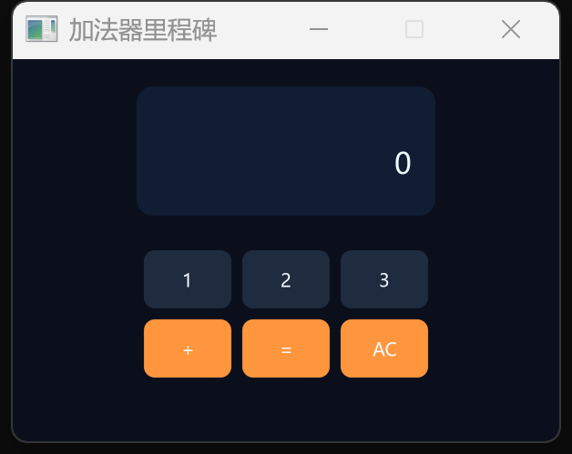

# 构建多文件计算器

## 你将完成

本教程先用一个完整可运行的单文件加法器确认鼠标命中、文本输入、文字度量和绘制都工作，再把同一职责扩展为仓库中的真实多文件计算器。最终工程至少包含 `main.cj`、`state.cj`、`logic.cj`、`loop.cj`、`render.cj` 和 `theme.cj`：入口只装配窗口，状态保存显示值，逻辑处理运算，事件层翻译输入，渲染层只读状态，主题集中颜色。你会实际运行程序，并用鼠标和键盘完成 `12 + 3 = 15`。


上图来自当前仓库 `examples/calculator`，尺寸为 420×640，SHA-256 为 `7e291ebc8e9cf93a296dc4377af936c3026ce009bbd0bc630ace1fc18cb6fd09`。它用于核对信息层级、对齐和按钮可读性；你的窗口若只完成本页的最小里程碑，按钮数量可以更少，但不能省略可见结果和退出路径。

## 开始之前

先完成[首个窗口](../getting-started/first-window.md)并理解[资源所有权](../concepts/resource-ownership.md)。本教程假设 SDL 动态库和系统字体已经可用。完整仓库计算器位于 `sdl/examples/calculator`，可直接在该目录运行 `cjpm build` 和 `cjpm run`；第一次阅读时不要先改所有文件，先让基线成功，再逐层追踪一次输入。

## 先建立一个模型

一次点击从 `loop.cj` 开始：`MouseDown` 给出逻辑坐标，事件层用 `Rect.contains` 找到按钮，再把按钮标签交给 `logic.cj` 的 `press`。逻辑层只修改 `CalcState`，不知道鼠标、窗口或颜色；下一帧 `render.cj` 读取状态并重画。这条单向路径是排错线索：点击没反应先检查事件和命中，显示值错误检查逻辑，值正确但画面错检查渲染。

多文件不是为了增加目录数量，而是让变化有明确落点。增加 `√` 运算主要改状态与逻辑；调整按钮间距只改状态中的布局常量；换配色只改主题；增加键盘映射只改事件层。`main` 不应重新承担这些细节。

## 操作步骤

1. 先把下面完整程序放进新示例的主源文件。它提供数字 1、2、3、加号、等号和清除按钮，同时支持键盘文本输入。
2. 运行后用鼠标依次输入“12 + 3 =”；再按清除按钮，用键盘输入相同序列。两条路径必须得到同一结果。
3. 转到仓库的计算器示例运行真实多文件版本，按状态、逻辑、事件、渲染的顺序追踪一次按键。
4. 选择一个近迁移任务：在真实版本中加入 `00` 键或按下反馈，只改必要层，并再次运行。

## 完整程序

```cangjie verify role=complete profile=gui-visual
package guide_examples

import sdl.{Color, FontSizes, Key, MouseButton, Rect, SdlWindow, UiEvent, WindowSpec}

func keyAt(x: Float32, y: Float32): String {
    if (Rect(144.0, 210.0, 96.0, 64.0).contains(x, y)) {
        "1"
    } else if (Rect(252.0, 210.0, 96.0, 64.0).contains(x, y)) {
        "2"
    } else if (Rect(360.0, 210.0, 96.0, 64.0).contains(x, y)) {
        "3"
    } else if (Rect(144.0, 286.0, 96.0, 64.0).contains(x, y)) {
        "+"
    } else if (Rect(252.0, 286.0, 96.0, 64.0).contains(x, y)) {
        "="
    } else if (Rect(360.0, 286.0, 96.0, 64.0).contains(x, y)) {
        "AC"
    } else {
        ""
    }
}

main(): Unit {
    try (window = SdlWindow(WindowSpec("加法器里程碑", 600, 420, resizable: false))) {
        var display: Int64 = 0
        var stored: Int64 = 0
        var enteringNew = true
        var running = true

        while (running) {
            var current = window.pollEvent()
            while (let Some(event) <- current) {
                var label = ""
                match (event) {
                    case UiEvent.Quit => running = false
                    case UiEvent.KeyDown(Key.Escape, _) => running = false
                    case UiEvent.KeyDown(Key.Enter, _) => label = "="
                    case UiEvent.TextInput(text) => label = text
                    case UiEvent.MouseDown(MouseButton.Left, x, y) => label = keyAt(x, y)
                    case _ => ()
                }

                if (label == "1" || label == "2" || label == "3") {
                    let digit = if (label == "1") {
                        1
                    } else if (label == "2") {
                        2
                    } else {
                        3
                    }
                    display = if (enteringNew) {
                        digit
                    } else {
                        display * 10 + digit
                    }
                    enteringNew = false
                } else if (label == "+") {
                    stored = display
                    enteringNew = true
                } else if (label == "=") {
                    display = stored + display
                    enteringNew = true
                } else if (label == "AC") {
                    display = 0
                    stored = 0
                    enteringNew = true
                }
                current = window.pollEvent()
            }

            let r = window.renderer
            r.beginScene(600.0, 420.0, Color.rgb(11, 15, 28))
            r.fillRoundedRect(Rect(136.0, 30.0, 328.0, 142.0), 18.0, Color.rgb(17, 29, 51))
            let shown = "${display}"
            r.text(shown, 438.0 - r.textWidth(shown, pointSize: FontSizes.DISPLAY), 92.0, Color.rgb(238, 252, 255),
                pointSize: FontSizes.DISPLAY)
            let labels = ["1", "2", "3", "+", "=", "AC"]
            let boxes = [
                Rect(144.0, 210.0, 96.0, 64.0),
                Rect(252.0, 210.0, 96.0, 64.0),
                Rect(360.0, 210.0, 96.0, 64.0),
                Rect(144.0, 286.0, 96.0, 64.0),
                Rect(252.0, 286.0, 96.0, 64.0),
                Rect(360.0, 286.0, 96.0, 64.0)
            ]
            for (i in 0..labels.size) {
                let box = boxes[i]
                r.fillRoundedRect(box, 12.0, if (i >= 3) {
                    Color.rgb(255, 150, 61)
                } else {
                    Color.rgb(31, 43, 63)
                })
                r.textCenter(labels[i], box, Color.rgb(244, 250, 255), pointSize: FontSizes.TITLE)
            }
            r.endScene()
            r.present()
            window.delay(UInt32(8))
        }
    }
}
```

这段程序是可运行的学习里程碑，不是推荐的最终结构。它故意把状态、事件和绘制放在一个文件中，让你先观察完整数据流；随后真实示例把这些职责拆开。拆分时保持调用方向 `main → loop → logic/render`，不要让纯计算逻辑反向导入 SDL。

## 确认结果



窗口应显示深色读数面板和六个清晰按钮。鼠标依次输入“12 + 3 =”后读数是 15，清除按钮让它归零。键盘字符走同一套标签处理，回车映射为等号，Esc 退出。

真实多文件示例还应显示 4×5 网格、右对齐读数、运算符提示和软阴影；验证截图中数字与按钮对比度足够，边缘没有被裁掉。

## 接着试一试

在真实 `examples/calculator` 中给按钮增加按下反馈。状态层新增 `pressedLabel`，`MouseDown` 设置，`MouseUp` 清除；渲染层只根据该值把对应矩形下移。下面是事件与绘制边界的核心变化，实际实现时仍保留原有文件分工。

```cangjie role=variation
case UiEvent.MouseDown(MouseButton.Left, x, y) => state.pressedLabel = labelAt(state, x, y)
case UiEvent.MouseUp(MouseButton.Left, _, _) => state.pressedLabel = None<String>

let drawBox = if (state.pressedLabel == Some(button.label)) {
    button.rect.shift(0.0, 3.0)
} else {
    button.rect
}
```

确认按下时只有视觉位置变化，运算仍由 `press` 处理；拖出按钮再松开也会清除状态。这个练习要求改状态、事件和渲染三个明确位置，正好检验你是否理解多文件边界。

## 如果没有成功

鼠标点击无反应时打印逻辑坐标和命中的标签，不要先改运算；键盘数字无反应时确认监听的是 `TextInput` 而非只匹配扫描码；读数正确但右对齐错误时确认 `textWidth` 与 `text` 使用同一字号、样式和字体。真实示例编译失败时从该示例目录运行 `cjpm build`，并确认相对依赖仍指向上层 SDL。窗口不关闭时检查 `Quit` 与 `Escape` 是否最终把 `isRunning` 设为 false。

## 相关 API

- [`SdlWindow`](../../api/sdl/SdlWindow.md)：事件、渲染器和窗口生命周期。
- [`UiEvent`](../../api/sdl/UiEvent.md)：鼠标、键盘和文本输入事件。
- [`Rect`](../../api/sdl/Rect.md)：按钮布局与命中测试。
- [`Renderer`](../../api/sdl/Renderer.md)：圆角、文字度量、居中和场景提交。

## 下一步

桌面应用读者可继续[平台诊断工具](platform-toolbox.md)；游戏读者进入[输入事件与持续状态](../concepts/input-state.md)，把一次按下扩展成跨帧移动。
