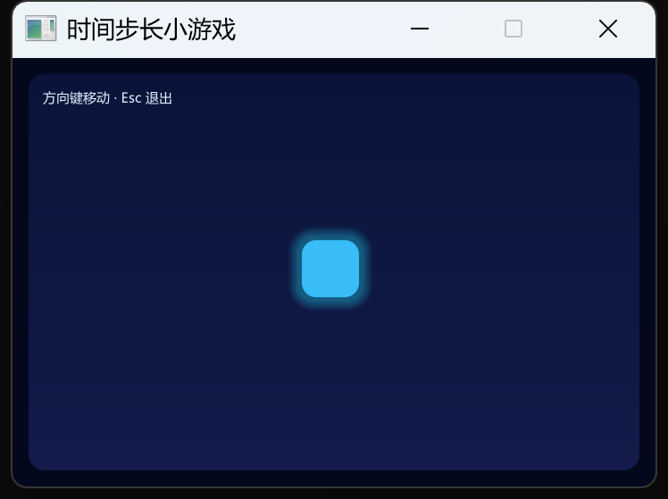

# 构建实时小游戏

## 你将完成

本教程构建一个可用方向键移动的发光方块：程序把按下和抬起事件保存成持续状态，用相邻帧的毫秒差计算 `dt`，按每秒速度更新位置，并把异常长帧限制在 50ms。最终你能解释事件、更新、边界限制、渲染和限速的顺序，再把同一骨架映射到仓库中的 `thunder` 射击游戏与更大的 `contra` 多包工程。


图中显示了分层背景、玩家、连续子弹、HUD 与实体集合，本页的完整程序先把时间和输入骨架做对，再引导你进入这些真实层次。

## 开始之前

先完成[输入事件与持续状态](../concepts/input-state.md)和[时间步长与游戏循环](../concepts/game-loop-timing.md)。确认首个窗口能稳定运行，方向键不会被系统输入法拦截。预计完整程序约十五分钟，随后阅读 `examples/thunder` 的九个源文件约三十分钟。不要用“每帧移动 5 像素”作为速度；那会让 144Hz 显示器上的移动比 60Hz 快得多。

## 先建立一个模型

一次帧循环按固定顺序执行：读取单调时钟并求 `dt`，取空事件队列并更新输入状态，用 `speed * dt` 更新位置，限制到舞台范围，绘制当前状态，最后短暂延时。事件只改变 `leftHeld` 等布尔值，不直接移动；渲染只读位置，不修改业务状态。长帧限制不是让慢机器变快，而是防止拖动窗口或断点暂停后一次更新跨过整个碰撞区域。

真实 `thunder` 在同一顺序中增加实体集合、刷新计时器、AABB 碰撞、粒子和 HUD；`contra` 又把几何、模型、模拟、骨骼和渲染拆成单向依赖的子包。扩展时先确定变化属于输入、模拟还是表现，再进入相应层。

## 操作步骤

1. 把下面完整程序保存为独立项目的 `src/main.cj`，运行后按住方向键移动。
2. 在窗口移动时观察方块不会越过边界；拖动窗口标题栏停顿一秒，再松开，方块不应瞬间穿到另一侧。
3. 打开 `examples/thunder/src/loop.cj`，找到同样的 `ticks → dt → handleEvents → update → draw` 顺序。
4. 再追踪 `KeyDown` 到 `InputState`，以及 `systems.cj` 中 `dt` 怎样进入玩家、子弹和敌机更新。

## 完整程序

```cangjie verify role=complete profile=gui-visual
package guide_examples

import sdl.{Color, Key, Rect, SdlWindow, UiEvent, WindowSpec, clampF32}

main(): Unit {
    try (window = SdlWindow(WindowSpec("时间步长小游戏", 720, 480, resizable: false))) {
        var x: Float32 = 324.0
        var y: Float32 = 204.0
        var leftHeld = false
        var rightHeld = false
        var upHeld = false
        var downHeld = false
        var running = true
        var lastTicks = window.ticks()

        while (running) {
            let now = window.ticks()
            let dt = clampF32(Float32(now - lastTicks) / 1000.0, 0.0, 0.05)
            lastTicks = now

            var current = window.pollEvent()
            while (let Some(event) <- current) {
                match (event) {
                    case UiEvent.Quit => running = false
                    case UiEvent.KeyDown(Key.Escape, _) => running = false
                    case UiEvent.KeyDown(Key.Left, _) => leftHeld = true
                    case UiEvent.KeyDown(Key.Right, _) => rightHeld = true
                    case UiEvent.KeyDown(Key.Up, _) => upHeld = true
                    case UiEvent.KeyDown(Key.Down, _) => downHeld = true
                    case UiEvent.KeyUp(Key.Left) => leftHeld = false
                    case UiEvent.KeyUp(Key.Right) => rightHeld = false
                    case UiEvent.KeyUp(Key.Up) => upHeld = false
                    case UiEvent.KeyUp(Key.Down) => downHeld = false
                    case _ => ()
                }
                current = window.pollEvent()
            }

            let speed: Float32 = 240.0
            if (leftHeld) {
                x -= speed * dt
            }
            if (rightHeld) {
                x += speed * dt
            }
            if (upHeld) {
                y -= speed * dt
            }
            if (downHeld) {
                y += speed * dt
            }
            x = clampF32(x, 20.0, 636.0)
            y = clampF32(y, 20.0, 396.0)

            let r = window.renderer
            r.beginScene(720.0, 480.0, Color.rgb(4, 8, 28))
            r.fillRoundedRectGradient(
                Rect(18.0, 18.0, 684.0, 444.0),
                18.0,
                Color.rgb(10, 20, 58),
                Color.rgb(18, 27, 74)
            )
            r.fillRoundedRectSoft(Rect(x - 10.0, y - 10.0, 84.0, 84.0), 24.0, Color.rgba(34, 211, 238, 90),
                feather: 12.0)
            r.fillRoundedRect(Rect(x, y, 64.0, 64.0), 16.0, Color.rgb(56, 189, 248))
            r.text("方向键移动 · Esc 退出", 34.0, 34.0, Color.rgb(224, 242, 254))
            r.endScene()
            r.present()
            window.delay(UInt32(4))
        }
    }
}
```

`dt` 使用秒作为单位，所以 `speed = 240` 的含义是每秒 240 个逻辑像素。四个布尔值允许斜向移动；若需要斜向与横向同速，应在更新层归一化方向向量，而不是在事件分支里做特例。

## 确认结果



按住一个方向键，方块应连续移动；松开立即停止，快速点按只产生短位移。左右和上下边界都保留 20 像素空白。拖住窗口造成长停顿后释放，方块最多按 50ms 更新，不会跳出画面。关闭窗口或按 Esc 后进程退出码为 0。真实窗口截图还要人工检查发光边缘、文字和方块是否清晰；编译通过不能证明这三点。

运行 `examples/thunder` 时，确认方向键移动、空格连射、生命与分数可见，游戏结束后空格重开。代码追踪应能回答：谁保存按键状态、谁计算刷新间隔、谁倒序删除实体、谁判断碰撞、谁决定绘制层次。答不出来时回到对应文件，而不是只看 `main.cj`。

## 接着试一试

给方块增加短冲刺：按 Space 时把 `dashRemaining` 设为 0.12 秒，更新时使用更高速度并逐帧扣减。下面变化同时涉及事件和模拟，但不进入渲染层；渲染只根据剩余时间改变颜色。

```cangjie role=variation
case UiEvent.KeyDown(Key.Space, false) => dashRemaining = 0.12

let currentSpeed = if (dashRemaining > 0.0) { 520.0 } else { 240.0 }
dashRemaining = clampF32(dashRemaining - dt, 0.0, 0.12)
let playerColor = if (dashRemaining > 0.0) { Color.rgb(250, 204, 21) } else { Color.rgb(56, 189, 248) }
```

近迁移到 `thunder` 时，可把它实现为玩家技能：配置值放 `config.cj`，状态放 `model.cj`，输入边沿放 `loop.cj`，位移和冷却放 `systems.cj`，颜色或残影放 `render.cj`。确认新增逻辑没有反向依赖渲染。

## 如果没有成功

按键一直保持按下时检查 `KeyUp` 是否覆盖四个方向；速度随刷新率变化时检查是否把每秒速度乘了 `dt`；拖动窗口后穿透时检查上限是否在秒换算之后；画面闪烁时检查一帧是否只调用一次 `beginScene/endScene/present`。真实游戏中实体删除错乱时，确认数组倒序遍历。更系统的诊断见[渲染与截图排错](../troubleshooting/render-output.md)和[事件、资源与平台排错](../troubleshooting/events-resources-platform.md)。

## 相关 API

- [`SdlWindow`](../../api/sdl/SdlWindow.md)：毫秒时钟、事件、延时和窗口资源。
- [`UiEvent`](../../api/sdl/UiEvent.md)：按下、抬起和退出事件。
- [`Key`](../../api/sdl/Key.md)：方向键、空格与 Escape。
- [`Renderer`](../../api/sdl/Renderer.md)：场景、圆角和软边绘制。
- [`FrameInfo`](../../api/sdl/FrameInfo.md)：需要把帧时长作为事件值传递时使用。

## 下一步

继续[渲染与截图排错](../troubleshooting/render-output.md)，学习用最小场景、截图和状态查询定位空白或模糊画面。
