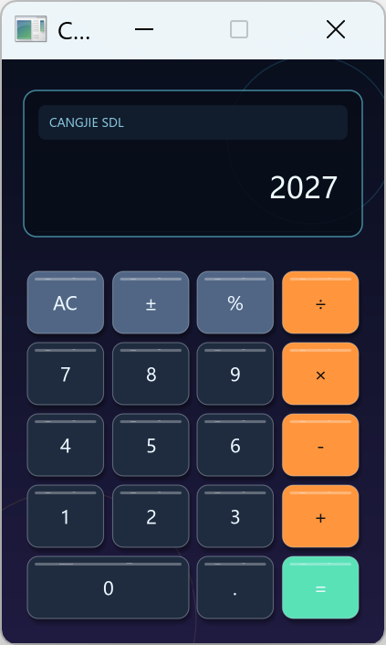
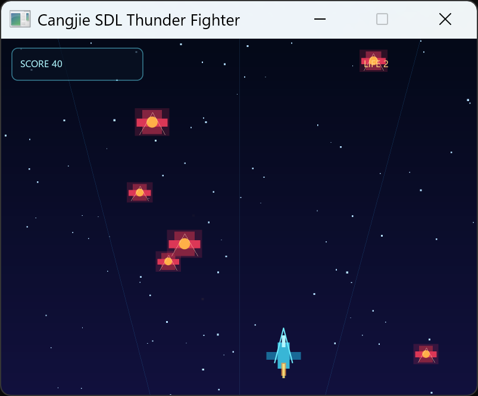
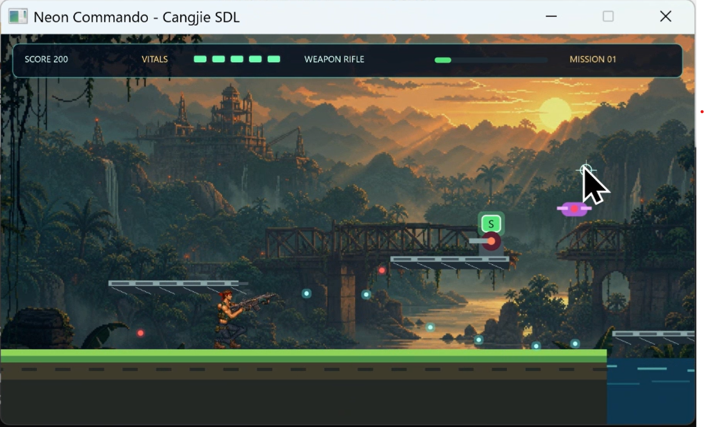

# CangjieSDL 示例集

本目录包含 3 个可独立构建、可直接运行的仓颉项目。它们从桌面控件绘制逐步过渡到实时游戏和
中型分包工程，适合按下表顺序学习。每个项目都通过路径依赖引用仓库根目录的 `sdl` 模块：

```toml
[dependencies]
sdl = { path = "../.." }
```

## 示例一览

| 示例 | 建议起点 | 主要内容 |
|---|---|---|
| [calculator](calculator/) | 第一次使用 CangjieSDL | 事件循环、鼠标命中、文本输入、圆角控件、文字度量与对齐 |
| [thunder](thunder/) | 开始编写实时应用 | 时间步长、持续按键状态、实体更新、AABB 碰撞、粒子和 HUD |
| [contra](contra/) | 学习中型游戏工程 | 多子包分层、纹理资源、世界/屏幕坐标、2D 骨骼、IK 与蒙皮 |

### Calculator

[](calculator/)

### Thunder Fighter

[](thunder/)

### Neon Commando

[](contra/)

## 环境要求

- 仓颉 SDK `1.0.5`，并确保 `cjpm` 可在终端中执行。
- Windows x86_64；仓库 `.sdl3/` 中已按当前项目配置放置 SDL3 与 SDL3_ttf 动态库。
- 支持图形窗口的桌面会话。构建本身不要求显示器，但运行示例需要。

先在仓库根目录确认工具链和基础库可用：

```powershell
cjpm --version
cjpm build
```

## 构建与运行

进入任一示例目录后执行：

```powershell
cjpm build
cjpm run
```

例如从仓库根目录启动计算器：

```powershell
Set-Location examples\calculator
cjpm run
```

`cjpm run` 会配置构建与运行所需的库搜索路径。如果绕过 cjpm，直接运行
`target/release/bin/main.exe`，请先把 `SDL3.dll` 与 `SDL3_ttf.dll` 复制到可执行文件同目录：

```powershell
Copy-Item ..\..\.sdl3\SDL3.dll, ..\..\.sdl3\SDL3_ttf.dll target\release\bin\
```

完整的构建期链接、运行时 DLL 与分发说明见
[部署、动态库与 FFI](../docs/deployment-and-ffi.md)。

## 推荐学习路线

1. 运行 [calculator](calculator/)，从 `main.cj → loop.cj → logic.cj → render.cj` 理解一次完整的
   输入—状态—绘制闭环。
2. 运行 [thunder](thunder/)，重点比较“按键事件”和“持续输入状态”的区别，再跟踪 `dt` 如何
   驱动所有实体更新。
3. 最后阅读 [contra](contra/)，从包依赖图入手，只沿一个功能链路阅读，例如
   `输入 → 玩家模拟 → 骨架求值 → 主角绘制`，不要一开始逐文件通读。

## 三个示例共用的应用骨架

- `main.cj` 只负责装配资源；`SdlWindow` 等资源使用 try-with-resources 自动关闭。
- 每帧先取空事件队列，再更新状态，最后绘制，避免输入延迟和半更新画面。
- 绘制遵循 `beginScene → 图元/文字/纹理 → endScene → present`；开启超采样时，
  `endScene` 负责把高分辨率目标解析回窗口。
- 事件层只把 SDL 输入翻译为业务意图，模拟层不直接绘制，渲染层只读当前状态。
- 布局、速度、冷却和配色集中到语义常量中，便于调参，也避免散落魔法数字。

## 常见问题

- **提示找不到 SDL DLL**：优先使用 `cjpm run`；直接运行 exe 时按上文复制两个 SDL DLL。
- **窗口文字不可见或字体异常**：文本渲染使用系统 UI 字体；确认系统存在可用中文字体。
- **修改根模块后示例仍像旧版本**：在示例目录执行 `cjpm clean`，再重新 `cjpm build`。
- **只想验证是否能编译**：运行 `cjpm build` 即可，不需要启动图形窗口。
