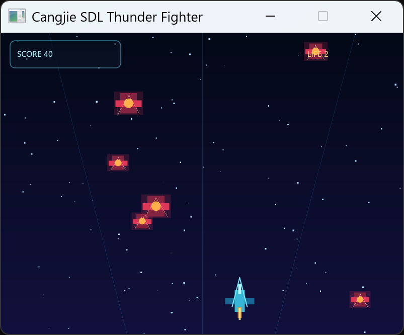

# CangjieSDL 示例教程

这里的三个示例不是彼此孤立的演示，而是一条由浅入深的学习路线：先完成事件驱动的桌面应用，
再进入按帧更新的实时游戏，最后学习中型项目的分包、资源与动画架构。

建议每个示例都按“运行 → 带着问题读源码 → 做一个小改动 → 重新验证”的顺序学习。只浏览最终画面，
很难理解输入、状态、模拟和渲染之间的边界。

## 学习路线

| 阶段 | 示例 | 先掌握什么 | 完成标志 |
|---|---|---|---|
| 1 | [Calculator](calculator/) | 事件循环、输入归一化、状态机、命中测试、文字排版 | 能说明一次点击如何变成状态变化和新画面 |
| 2 | [Thunder Fighter](thunder/) | `dt`、持续输入、实体系统、集合删除、碰撞与渲染分层 | 能新增一种按时间运动的实体，并安全管理其生命周期 |
| 3 | [Neon Commando](contra/) | 多包依赖、世界坐标、纹理资源、2D 骨骼、IK 与蒙皮 | 能沿一项功能跨越输入、模拟、姿态和渲染层定位代码 |

### 第一站：Calculator

[](calculator/)

这个示例规模最小，适合建立 CangjieSDL 应用的基本心智模型。重点不是四则运算，而是同一份按键数据
如何同时服务于绘制和命中测试，以及鼠标、文本和控制键如何汇入统一的业务命令。

### 第二站：Thunder Fighter

[](thunder/)

这个示例把“收到事件才处理”扩展为“每帧都推进世界”。重点观察按键边沿事件如何变成持续输入状态，
以及所有速度、冷却和寿命如何通过秒单位的 `dt` 更新。

### 第三站：Neon Commando

[](contra/)

这个示例用 7 个包组织 2500 多行代码。重点不是逐文件通读，而是沿一条功能链跨层阅读，例如从鼠标
瞄准一直追踪到弹道、骨架、枪械和双臂绘制。

## 开始之前

- 安装仓颉 SDK `1.0.5`，并确保 `cjpm` 可在终端中执行。
- 当前仓库的原生库配置面向 Windows x86_64。
- 构建不需要图形桌面；运行示例和视觉验收需要可创建窗口的桌面会话。

先在仓库根目录确认工具链与 CangjieSDL 本身可用：

```powershell
cjpm --version
cjpm build
```

每个示例都是独立的 cjpm 项目，并通过路径依赖引用仓库根模块：

```toml
[dependencies]
sdl = { path = "../.." }
```

## 构建和运行

进入示例目录后执行：

```powershell
cjpm build
cjpm run
```

例如从仓库根目录启动计算器：

```powershell
Set-Location examples\calculator
cjpm run
```

推荐使用 `cjpm run`，项目配置会处理运行时库搜索路径。若直接启动
`target/release/bin/main.exe`，需要先把 `SDL3.dll` 和 `SDL3_ttf.dll` 放到可执行文件目录。
完整方法见[部署 SDL 原生运行库](../docs/guide/how-to/deploy-native-runtime.md)。

## 三个示例共用的程序模型

三个项目的复杂度不同，但主循环都遵循同一条数据流：

```text
创建窗口与资源
      ↓
取空事件队列 → 更新输入/业务状态 → 按当前状态绘制 → 提交画面
      ↑                                      │
      └──────────── 下一帧 ──────────────────┘
```

这条数据流包含五个可复用的工程约定：

1. `main.cj` 只装配长期资源，窗口和纹理由 `Resource` 作用域确定性释放。
2. 事件层把 SDL 事件翻译为业务输入，不在事件分支中直接拼出画面。
3. 状态是事实来源；模拟层修改状态，渲染层按约定只读取状态。
4. 一帧先处理输入，再更新世界，最后绘制，避免表现落后于逻辑。
5. 绘制集中在 `beginScene → draw... → endScene → present` 之间，场景逻辑尺寸保持稳定。

Calculator 没有连续模拟，因此事件处理后直接重绘；两个游戏则在输入与绘制之间增加
`update(state, dt)`。这正是从普通窗口程序过渡到实时应用的关键变化。

## 建议的学习方法

### 1. 先运行，再提出一个具体问题

例如：“鼠标点中按键后发生了什么？”“按住方向键为什么能连续移动？”“镜头移动后碰撞框为什么
仍在世界坐标中？”问题越具体，越容易沿调用链理解职责边界。

### 2. 只追踪一条执行链

- Calculator：`UiEvent → handleEvent → press → CalcState → draw`
- Thunder Fighter：`KeyDown/KeyUp → InputState → updatePlayer → handleCollisions → draw`
- Neon Commando：`输入 → contra.sim → contra.rig → contra.render`

先看入口和数据流，再查某个函数的实现；不要从第一个文件开始顺序阅读所有辅助函数。

### 3. 用小改动检验理解

优先修改集中配置或增加一个可观察行为。每篇教程都给出了由易到难的练习和验收标准。若修改后无法
预测哪些文件应受影响，说明模块边界还没有真正建立起来。

## 验证

维护者可在仓库根目录一次构建全部示例：

```powershell
python .dev\cli.py test examples --timeout 600
```

自动构建只能证明工程和依赖完整。视觉验收仍应逐个执行 `cjpm run`，检查输入、字体、纹理、透明度、
窗口关闭和结算重开流程。

## 常见问题

- **提示找不到 SDL DLL**：优先使用 `cjpm run`；直接运行 exe 时按上文部署两个动态库。
- **纹理加载失败**：从对应示例目录运行程序；资源路径相对于当前工作目录解析。
- **修改根模块后仍像旧版本**：在示例目录执行 `cjpm clean`，再重新构建。
- **只想确认代码可编译**：执行 `cjpm build` 即可，不需要启动窗口。
- **文字不可见或字形异常**：确认系统存在可用字体，并参阅[文本与字体](../docs/guide/how-to/text-and-fonts.md)。
