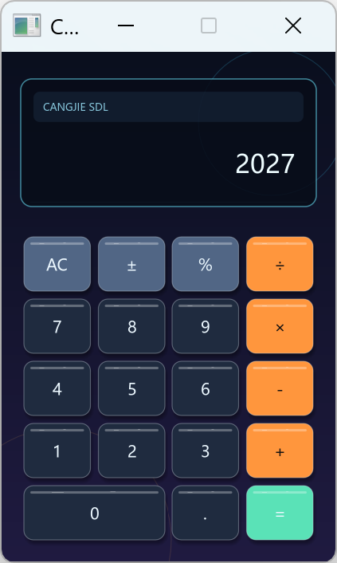

# Calculator 教程：从输入事件到可绘制状态

这个 420×640 的四则运算计算器是学习 CangjieSDL 应用结构的起点。它把鼠标命中、键盘文本输入、
业务状态机和自绘界面放进一个足够小的项目，让你能完整追踪一次交互，而不被复杂工程结构分散注意力。



## 学完以后

你应该能够：

- 用 `SdlWindow` 建立窗口，并用资源作用域保证退出时释放原生对象；
- 区分文本输入与控制键事件，把鼠标和键盘归一化为同一组业务命令；
- 用少量字段表达计算器状态，并解释每次按键如何触发状态迁移；
- 让一份按键布局同时驱动绘制和命中测试，避免坐标重复；
- 用圆角、描边、软阴影、文字度量和居中接口组合自绘控件。

## 运行和操作

从仓库根目录执行：

```powershell
Set-Location examples\calculator
cjpm build
cjpm run
```

- 鼠标左键可点击所有按键。
- 键盘可输入 `0-9`、`.`、`+`、`-`、`*`、`/`、`%` 和 `=`。
- `Enter` 等同于 `=`，`Backspace` 逐位删除，`Esc` 退出。

如果程序提示找不到 SDL 动态库，请先阅读[示例总览的构建和运行说明](../README.md#构建和运行)。

## 先建立整体模型

一次交互沿下面的路径流动：

```text
SDL 事件
  ├─ 鼠标左键 ─→ pressAt ─┐
  ├─ 文本输入 ─→ pressText ├─→ press(label) ─→ CalcState ─→ draw
  └─ 控制键 ───────────────┘
```

这里有两个关键设计：

1. 输入层只负责“这个动作代表哪个按键”，计算逻辑不关心动作来自鼠标还是键盘。
2. 渲染层只读取 `CalcState`。业务结果先进入状态，再由下一次 `draw` 统一呈现。

先记住这条主线，后面的文件和函数都会自然归位。

## 源码地图

| 文件 | 负责什么 | 阅读时回答的问题 |
|---|---|---|
| [`src/main.cj`](src/main.cj) | 创建窗口，进入主循环 | 谁拥有窗口，何时释放？ |
| [`src/state.cj`](src/state.cj) | 布局、按键描述和 `CalcState` | 哪些数据决定行为，哪些数据决定外观？ |
| [`src/logic.cj`](src/logic.cj) | 按键分发、运算与结果格式化 | 一次按键会修改哪些状态？ |
| [`src/loop.cj`](src/loop.cj) | 事件循环、鼠标命中和键盘映射 | 不同输入怎样汇入同一逻辑入口？ |
| [`src/render.cj`](src/render.cj) | 背景、显示面板与按键绘制 | 当前状态如何变成画面？ |
| [`src/theme.cj`](src/theme.cj) | 调色板 | 如何只改颜色而不碰绘制流程？ |

推荐按表格顺序阅读，但不要试图记住每个常量。先理解各文件之间传递什么数据，再进入具体实现。

## 第一课：让资源生命周期一眼可见

[`main.cj`](src/main.cj) 只做两件事：创建固定尺寸的 `SdlWindow`，然后调用 `runCalculator`。
窗口位于 try-with-resources 作用域内，因此正常退出或抛出异常时都会执行 `close()`。这种写法把资源所有权
放在装配入口，业务函数不需要猜测自己是否应释放窗口。

当前布局使用固定逻辑坐标，所以 `WindowSpec` 将 `resizable` 设为 `false`。若以后开放缩放，需要同时设计
新的布局规则，而不是只把开关改为 `true`。

## 第二课：一份布局，两种用途

[`state.cj`](src/state.cj) 把窗口、面板和按键网格参数分别放进 `View`、`Panel` 与 `Pad`。每个 `Button`
同时保存标签、矩形和语义角色：

- [`render.cj`](src/render.cj) 遍历 `state.buttons` 绘制按键；
- [`loop.cj`](src/loop.cj) 遍历同一集合，用 `Rect.contains` 做鼠标命中测试；
- [`logic.cj`](src/logic.cj) 接收按键标签，不再处理像素坐标。

因此，`"0"` 键横跨两列这样的布局信息只定义一次。以后移动、增删按键时，显示区域和点击区域不会悄悄
失去同步。这是数据驱动 UI 的一个小而完整的例子。

## 第三课：把设备输入翻译为业务命令

[`handleEvent`](src/loop.cj) 处理三类输入：

| 输入 | 处理路径 | 为什么这样设计 |
|---|---|---|
| 鼠标左键 | 坐标 → `pressAt` → 按键标签 | 命中测试只属于界面层 |
| `TextInput` | 文本 → Rune → `labelForRune` | 系统已经处理键盘布局和修饰键 |
| `KeyDown` | `Enter`、`Backspace`、`Escape` | 控制键不是普通文本 |

最终，鼠标点击 `×`、键盘输入 `*` 或 `x` 都会调用 `press(state, "×")`。增加新的输入设备时，只需新增
一层翻译，不必复制计算逻辑。

窗口创建时 CangjieSDL 会启动文本输入。处理可输入字符时优先使用 `UiEvent.TextInput`，不要根据物理按键
自行推断字符；后者在不同键盘布局和修饰键组合下并不可靠。

## 第四课：用显式状态描述运算过程

`CalcState` 的核心字段并不多：

| 字段 | 含义 |
|---|---|
| `display` | 当前输入缓冲，也是显示面板的读数来源 |
| `stored` | 已保存的左操作数或上一阶段结果 |
| `pending: ?CalcOp` | 待执行运算；`None` 明确表示尚未选择运算符 |
| `shouldResetDisplay` | 下一次数字输入应覆盖还是追加 |
| `hasError` | 除零后的错误状态 |

以 `12 + 3 =` 为例：

| 输入后 | `display` | `stored` | `pending` | `shouldResetDisplay` |
|---|---:|---:|---|---|
| `12` | `12` | `0` | `None` | `false` |
| `+` | `12` | `12` | `Add` | `true` |
| `3` | `3` | `12` | `Add` | `false` |
| `=` | `15` | `15` | `None` | `true` |

这张表就是状态机。`press` 负责按标签分发，`chooseOperation`、`finishOperation` 和 `computeWith` 分别负责
状态迁移的不同阶段。除数接近零时，`fail` 会统一设置错误文本、清除待执行运算，并让下一次有效输入从
干净状态重新开始。

## 第五课：按当前状态统一绘制

[`draw`](src/render.cj) 每帧执行相同顺序：开始场景、绘制背景、绘制显示面板、遍历按键、结束场景、
提交画面。它不会为“刚刚点击了什么”保留另一套表现状态。

值得重点观察三种组合能力：

- `fillRoundedRect`、`strokeRoundedRect` 与 `Pen` 组成按键主体和边框；
- `fillRoundedRectSoft` 生成带羽化边缘的阴影；
- `textWidth` 先度量读数，再计算右对齐位置；过宽时切换到较小字号；
- `textCenter` 直接在按键矩形内居中标签，不再手算基线和水平偏移。

背景渐变使用多条纯色矩形近似完成。这不是唯一方案，却很好地说明了 CangjieSDL 的即时绘制接口如何
组合成更高层的视觉效果。

## 动手练习

按下面顺序修改，每次只验证一个概念。

### 练习 1：调整布局，不改交互代码

修改 [`state.cj`](src/state.cj) 中的 `Pad` 参数，让按键间距更大。验收时确认视觉间距和鼠标命中区域同步
变化；如果还需要改 `pressAt`，说明布局数据仍有重复。

### 练习 2：增加按下反馈

在状态中记录当前按下的按钮；在 `MouseDown` 和 `MouseUp` 更新它；渲染时让对应矩形向下偏移 2 像素。
验收标准是只有当前按钮移动，松开或指针离开后恢复，计算结果仍只触发一次。

### 练习 3：为纯逻辑增加测试

用一串 `press` 调用驱动 `CalcState`，至少覆盖 `12 + 3 =`、连续运算、小数、退格和除零。测试只检查状态，
不创建窗口。这样可以直观看到“输入归一化”和“状态先于渲染”带来的可测试性。

## 验证清单

- 鼠标和键盘执行相同运算时结果一致；
- `Enter`、`Backspace` 和 `Esc` 分别完成确认、删除和退出；
- 小数点不能在同一数字中重复输入，除零后下一次输入能恢复；
- 长结果会缩小字号且保持右对齐；
- 关闭窗口和按 `Esc` 都能正常结束进程。

源码修改后先运行 `cjpm build`，再运行 `cjpm run` 完成输入与视觉验收。要继续学习按帧更新、持续输入和
实体系统，请进入 [Thunder Fighter 教程](../thunder/)。
