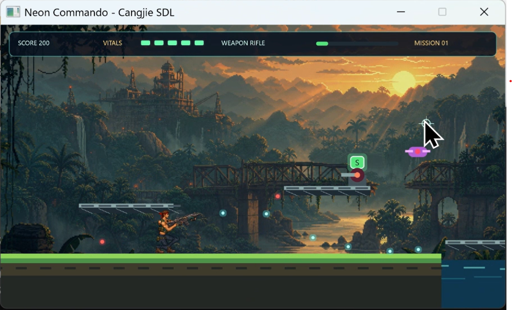

# Neon Commando 教程：组织中型 2D 动作游戏

`Neon Commando` 是一个单关横版动作射击示例。它包含平台、水域、步兵、炮台、无人机、扩散枪补给和
Boss，但真正值得学习的是：如何把 2500 多行实时游戏代码组织成依赖清晰的 7 个包，并让输入、模拟、
骨骼求值、资源管理与分层渲染各自保持明确职责。



## 学完以后

你应该能够：

- 画出各包的依赖方向，并解释为什么 `sim` 与 `render` 不应互相调用；
- 沿一项功能跨越输入、状态、模拟、姿态和渲染层定位代码；
- 分离世界坐标与屏幕坐标，让镜头移动不污染游戏规则；
- 用 `Resource` 集中管理纹理，不在重开一局时重复加载 GPU 资源；
- 理解双骨 IK、每帧姿态求值和纹理三角带蒙皮如何组成轻量 2D 骨骼动画。

开始前建议先完成 [Thunder Fighter 教程](../thunder/)。本示例沿用它的可变 `dt`、持续输入、实体集合和
碰撞系统，不再从头解释这些基础概念。

## 运行和操作

从仓库根目录执行：

```powershell
Set-Location examples\contra
cjpm build
cjpm run
```

| 动作 | 按键 |
|---|---|
| 左右移动 | 方向键或 `A` / `D` |
| 键盘瞄准 | 方向键或 `WASD`；可与射击组合成八向瞄准 |
| 键盘射击 | 按住 `K` |
| 跳跃 | 空格；起跳后在短时间内再次按下可逐级增加高度 |
| 鼠标瞄准和射击 | 移动鼠标连续瞄准，按住左键连射 |
| 下蹲 | 在地面按住下方向或 `S` |
| 重新挑战 | 结算界面按 `Enter` 或 `R` |
| 退出 | `Esc` |

绿色 `S` 补给会把步枪升级为三向扩散枪。若动态库或纹理加载失败，请先查看
[示例总览的构建和运行说明](../README.md#构建和运行)。

## 不要逐文件通读：先看依赖层次

项目由根包和 6 个子包组成。`sim` 与 `render` 是同级消费者：前者修改世界，后者按约定只读取世界；它们
都可以使用更低层能力，但不能互相依赖。

```text
contra（应用外壳：窗口、事件、帧循环）
├─ contra.sim（玩家、敌人、特效、碰撞）
├─ contra.render（场景、角色、纹理、HUD）
│       │
│       ├──────────────┐
│       ↓              ↓
├─ contra.rig（姿态与 IK）
├─ contra.model（实体与世界状态）
└─ contra.geom + contra.config（数学/骨骼原语 + 配置/配色）
```

图中上下位置表达职责层次，不代表每一层只依赖紧邻一层。实际导入以源码为准，但总体方向始终从应用和功能
包流向基础包，不会反向形成循环。

| 包 | 主要文件 | 稳定职责 |
|---|---|---|
| `contra` | [`main.cj`](src/main.cj)、[`loop.cj`](src/loop.cj) | 创建资源、接收事件、串联一帧 |
| `contra.config` | [`specs.cj`](src/config/specs.cj)、[`palette.cj`](src/config/palette.cj) | 集中保存尺寸、速度、冷却和颜色 |
| `contra.geom` | [`vector.cj`](src/geom/vector.cj)、[`math.cj`](src/geom/math.cj)、[`joint.cj`](src/geom/joint.cj)、[`ik.cj`](src/geom/ik.cj) | 2D 数学、骨骼原语和双骨 IK |
| `contra.model` | [`kinds.cj`](src/model/kinds.cj)、[`entities.cj`](src/model/entities.cj)、[`world.cj`](src/model/world.cj) | 类型、实体数据、世界状态和关卡编队 |
| `contra.rig` | [`pose.cj`](src/rig/pose.cj)、[`spine.cj`](src/rig/spine.cj)、[`legs.cj`](src/rig/legs.cj)、[`arms.cj`](src/rig/arms.cj) | 从玩家状态求出一帧骨架 |
| `contra.sim` | [`update.cj`](src/sim/update.cj)、[`player.cj`](src/sim/player.cj)、[`foes.cj`](src/sim/foes.cj)、[`effects.cj`](src/sim/effects.cj)、[`collision.cj`](src/sim/collision.cj) | 推进游戏世界并完成规则结算 |
| `contra.render` | [`view.cj`](src/render/view.cj)、[`environment.cj`](src/render/environment.cj)、[`actors.cj`](src/render/actors.cj)、[`hero.cj`](src/render/hero.cj)、[`skinning.cj`](src/render/skinning.cj)、[`hud.cj`](src/render/hud.cj)、[`assets.cj`](src/render/assets.cj) | 坐标转换、分层绘制和纹理生命周期 |

## 第一课：先追踪完整的一帧

从 [`runGame`](src/loop.cj) 开始。它计算被限制在 0 到 0.04 秒之间的可变 `dt`，然后依次执行：

```text
handleEvents → contra.sim.update → contra.render.draw
```

[`contra.sim.update`](src/sim/update.cj) 是模拟层唯一的逐帧入口。它先更新时间、粒子和震屏；若游戏仍在
进行，再依次推进玩家、镜头、子弹、敌人和补给，最后处理碰撞。一次性的跳跃输入在帧末清除，持续输入则
保留到对应的 `KeyUp` 或 `MouseUp`。

[`contra.render.draw`](src/render/view.cj) 是渲染层入口。它按背景、水面、地形、补给、敌人、子弹、玩家、
粒子、准星和 HUD 的顺序绘制。更新和绘制只通过 `GameState` 交接，不直接调用彼此。

掌握这三个入口后，再深入任何功能都不会失去方向。

## 第二课：让状态成为层与层之间的契约

[`GameState`](src/model/world.cj) 保存一局游戏的全部可变数据：玩家、输入、地形、实体集合、阶段、分数、
镜头、时间和震屏强度。职责约定如下：

- 根包把设备事件写入 `InputState`；
- `contra.sim` 根据输入和 `dt` 修改世界；
- `contra.rig` 根据 `Player` 计算当帧姿态，不修改游戏规则；
- `contra.render` 读取状态和姿态生成画面。

这种边界让“规则”与“表现”可以独立变化。例如，受击无敌由模拟层判断，而闪烁由渲染层表现；枪口位置由
骨架约束求出，射击和枪口火焰共用它，从而避免视觉枪口与子弹出生点分离。

### 跨包可见性

仓颉顶层声明默认是 `internal`，兄弟包不能直接访问。因此跨包使用的类型、字段和函数显式标为
`protected`，把可见范围限制在当前模块内。

可见性应随层次收窄：基础包提供较多可复用原语，功能包只暴露少量入口。例如，`contra.rig` 对外主要提供
`HeroSkeleton`、`evaluateHeroSkeleton` 和 `weaponMuzzlePoint`；`contra.sim` 对外只需要逐帧 `update`。
这不是语法负担，而是让依赖关系可以被编译器检查的接口设计。

## 第三课：沿“输入到射击”走一遍纵向链路

这是理解项目最有效的一条路线：

1. [`loop.cj`](src/loop.cj) 把键盘和鼠标事件写入 `InputState`。真实按下而非系统重复时，键盘操作才会
   从鼠标瞄准切回键盘瞄准。
2. [`targetPlayerAim`](src/sim/player.cj) 把键盘方向转换为离散单位向量，或把鼠标位置转换为连续瞄准向量。
3. [`updatePlayerAim`](src/sim/player.cj) 让鼠标瞄准平滑逼近目标；键盘瞄准则立即响应。
4. [`evaluateHeroSkeleton`](src/rig/pose.cj) 根据朝向、瞄准、移动、下蹲和腾空状态求出整副骨架。
5. [`weaponMuzzlePoint`](src/rig/arms.cj) 从握枪约束得到枪口位置。
6. [`firePlayerWeapon`](src/sim/player.cj) 在这个位置生成单发或三向子弹。
7. [`drawHeroRig`](src/render/hero.cj) 使用同一副骨架绘制身体、双臂、枪械和枪口火焰。

一项功能跨越多个包并不是坏事。关键在于每层只回答一个问题：设备发生了什么、玩家意图是什么、游戏规则
产生什么结果、身体应该是什么姿态、最终如何绘制。

## 第四课：分离世界坐标与屏幕坐标

地形、玩家、敌人和子弹都保存在世界坐标中。镜头只影响表现，不修改实体的真实位置。
[`worldX`](src/render/view.cj) 用“世界 X - 镜头 X + 震屏偏移”得到屏幕 X，`screenRect` 对矩形执行同样转换。

这条边界带来三个直接收益：

- 碰撞、关卡触发和敌人 AI 始终在稳定的世界坐标中计算；
- 镜头平滑跟随或 Boss 区锁定只改变 `cameraX`；
- 屏幕震动只影响最终坐标，不会让实体在逻辑世界中抖动。

调试镜头问题时，先确认数据属于哪种坐标系。不要在模型层提前减去 `cameraX`，也不要拿已经转换过的屏幕
矩形参与世界碰撞。

## 第五课：把纹理生命周期放在渲染边界

[`GameAssets`](src/render/assets.cj) 在窗口创建后一次性加载背景、角色部件、枪械和敌兵纹理，并设置透明
混合模式。它实现 `Resource`，在 [`main.cj`](src/main.cj) 的嵌套资源作用域中确定性关闭。

`resetGame` 只重建玩家和关卡状态，不重新加载纹理。这样“重开一局”是业务状态重置，不是 GPU 资源重建。
`GameAssets.close()` 还通过 `closed` 保证重复关闭安全，并按明确顺序释放纹理。

资源路径相对于运行时工作目录，所以应从 `examples/contra` 执行 `cjpm run`。若要发布独立程序，需要同时
设计资源目录和 SDL 动态库的部署位置。

## 第六课：从连续状态求出一副骨架

这个示例不使用整身逐帧贴图。每帧都由 [`evaluateHeroSkeleton`](src/rig/pose.cj) 从 `Player` 的位置、速度、
朝向、瞄准和融合权重求出新的 `HeroSkeleton`：

```text
Player 连续状态
   ↓
脊柱姿态（骨盆、腹、胸、头）
   ├─→ 双腿目标 → 双骨 IK
   └─→ 双臂目标 → 双骨 IK + 持枪约束
   ↓
HeroSkeleton
   ↓
分层贴图 + texturedStrip 蒙皮
```

骨架本身不保存跨帧动画状态。移动相位、落地融合、后坐力等连续量保存在玩家状态中，因此姿态求值是从状态到
骨架的明确转换，天然支持左右镜像和任意瞄准角。

### 双骨 IK 为什么需要极点

[`solveTwoBoneWithPole`](src/geom/ik.cj) 已知根关节、末端目标和两段骨长，用余弦定理解出中间关节。仅有
这些数据时，中间关节可以向连线两侧弯曲；额外的 `pole` 指定膝盖或肘部应位于哪一侧，避免瞄准方向变化时
关节突然翻面。目标超出臂展时，距离会被夹到可达范围，肢体自然伸直。

双腿在 [`legs.cj`](src/rig/legs.cj) 中把步态拆成 62% 支撑相和 38% 摆动相，移动距离累积为动画相位；腾空、
落地与下蹲使用不同的脚部目标。双臂在 [`arms.cj`](src/rig/arms.cj) 中分别锁定握把和护木，让枪械、双手和
弹道共享同一组约束。

### 蒙皮怎样消除肘膝硬接缝

[`skinning.cj`](src/render/skinning.cj) 沿一条两段骨链生成纹理三角带。关节附近的顶点位置、切向和宽度通过
`smoothStep` 在两根骨骼之间混合，使轮廓连续弯曲。上、下段纹理还在关节附近重叠，下段透明度平滑渐入，
从而减弱两张美术切片的明暗硬缝。髋部使用相同思路，把大腿顶部以柔边叠回腰带下缘。

这套实现展示了底层绘制接口的价值：`texturedStrip` 提供几何、纹理坐标和逐顶点透明度，项目可以在框架之上
构建自己的动画渲染器，而不受限于内置精灵能力。

## 四条推荐阅读路线

不要一次读完 27 个源码文件。按目标选择一条路线：

| 想理解什么 | 阅读路径 |
|---|---|
| 一帧怎样推进 | `loop.cj → sim/update.cj → render/view.cj` |
| 射击为何与枪口一致 | `loop.cj → sim/player.cj → rig/pose.cj + rig/arms.cj → render/hero.cj` |
| 受击和重生怎样结算 | `sim/collision.cj → model/entities.cj → model/world.cj → render/hud.cj` |
| 镜头和场景怎样协作 | `sim/effects.cj → render/view.cj → render/environment.cj` |

每条路线都先看公开入口和数据，再看辅助数学。阅读结束后，应该能说出每一步的输入、输出和所属坐标系。

## 动手练习

### 练习 1：只通过配置调整手感

修改 [`config/specs.cj`](src/config/specs.cj) 的奔跑速度、跳跃速度或扩散角。验收时确认无需修改模拟与渲染
代码，且相同参数只在一处定义。

### 练习 2：新增一种敌人

按数据 → 规则 → 表现的顺序修改：

1. 在 `contra.model` 增加敌人种类、尺寸、生命和分值；
2. 在 `contra.sim/foes.cj` 增加移动或射击规则；
3. 在 `contra.render/actors.cj` 增加外观；
4. 在 `world.cj` 放入关卡编队。

验收时确认新敌人能生成、受击、销毁和计分，并且没有让 `model` 反向依赖 `sim` 或 `render`。

### 练习 3：增加翻滚姿态

先在玩家状态和模拟层定义进入条件、时长与碰撞规则，再在 `contra.rig` 把脊柱、四肢目标按连续权重融合，
最后检查渲染。至少验证左右朝向、起止过渡、空中禁用和受击行为，不能只看一张静止姿态。

### 练习 4：复用几何与 IK

用 `contra.geom` 的 `RigPoint`、`RigBone` 和 `solveTwoBoneWithPole` 做一条跟随鼠标的机械臂。新实验不应
导入 `contra.model`、`contra.sim` 或 `contra.render`，以验证基础包确实可以独立复用。

## 验证清单

- 键盘与鼠标能平稳切换，按键自动重复不会反复抢占瞄准模式；
- 站立、下蹲、奔跑、上升和下落时，双手仍锁定枪械，弹道从可见枪口发出；
- 左右朝向、水平和大角度瞄准时，肘膝不会突然翻面；
- 镜头跟随、Boss 区锁定和震屏不改变世界碰撞结果；
- 跌落、受击、通关、失败和重新挑战都能完整重置业务状态，纹理不会重复加载；
- 所有纹理透明度和前后遮挡正确，关闭窗口和按 `Esc` 都能正常退出。

修改后先执行 `cjpm build`，再完整走通开始、移动、射击、受击、补给、Boss、结算和重新挑战流程。自动构建
不能替代骨骼接缝、透明混合、输入手感和不同姿态下的视觉验收。
